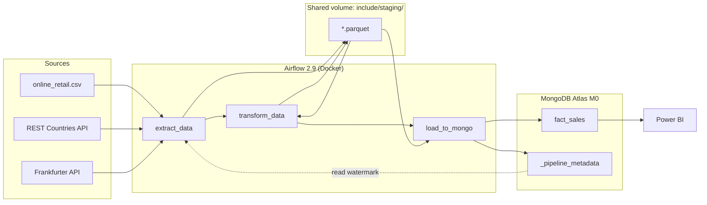
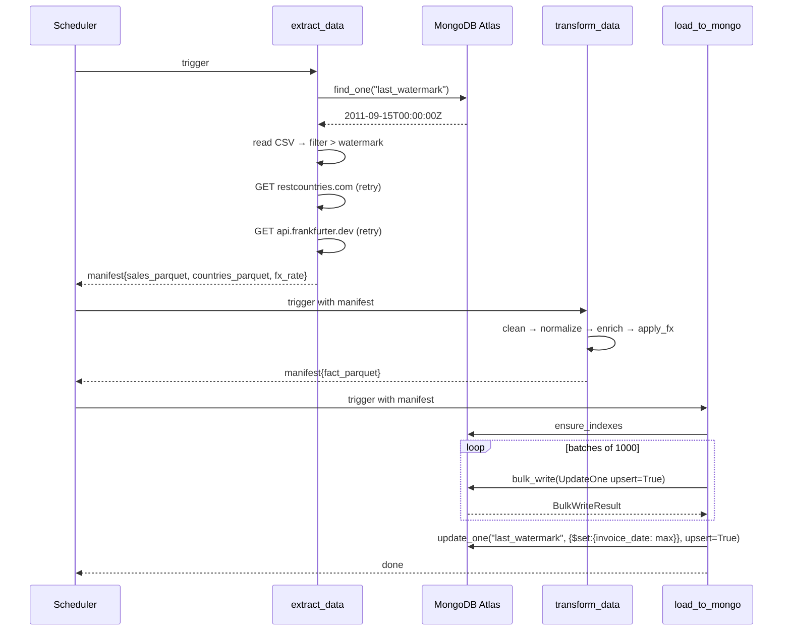

# Architecture

## High-level flow



## Sequence diagram — one DAG run



## Data contracts

### `fact_sales` document shape

```json
{
  "_id": "ObjectId(...)",
  "invoice_no": "536365",
  "stock_code": "85123a",
  "description": "white hanging heart t-light holder",
  "quantity": 6,
  "unit_price_gbp": 2.55,
  "invoice_date": "2010-12-01T08:26:00Z",
  "customer_id": "17850",
  "country": "united kingdom",
  "region": "Europe",
  "population": 67886011,
  "revenue_gbp": 15.30,
  "revenue_eur": 17.90,
  "fx_rate_gbp_eur": 1.170
}
```

### `_pipeline_metadata` document shape

```json
{
  "_id": "last_watermark",
  "invoice_date": "2011-12-09T12:50:00Z",
  "updated_at": "2024-06-01T02:00:37.125Z"
}
```

### Indexes on `fact_sales`

| Name | Fields | Purpose |
|---|---|---|
| `uq_business_key` (unique) | `invoice_no`, `stock_code`, `customer_id` | idempotent upserts |
| `ix_invoice_date` | `invoice_date` | watermark queries, Power BI time filter |
| `ix_region` | `region` | bar chart aggregation |
